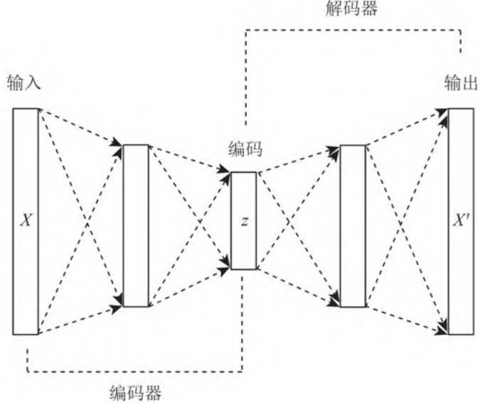
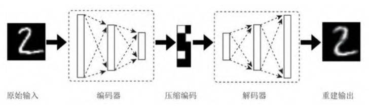
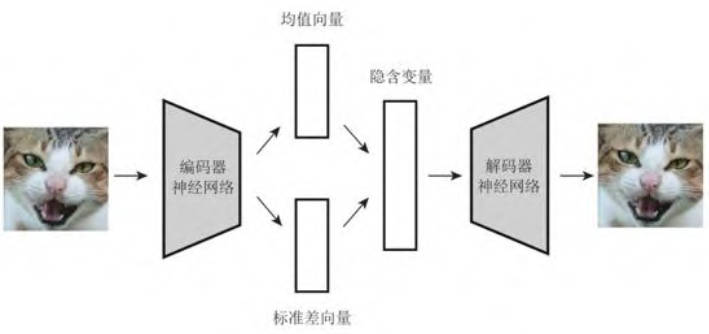
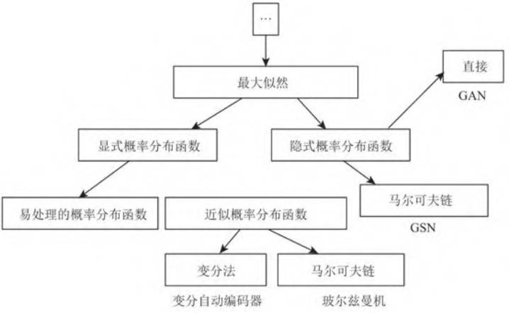

# GAN 神经网络-待修订版

## 1.GAN 生成式对抗网络

### 1.1 生成模型简介

生成模型是指能够再给定某些隐含参数的条件下，随机生成观测数据模型，它给观测值和标注数据序列指定了一个联合概率分布。

在机器学习中，生成模型可直接对数据建模，可根据某个变量的概率密度函数进行采样，也可以用来建立变量间的条件概率分布，条件概率分布可以由生成模型根据贝叶斯定理形成。

生成模型对于输入的随机样本能够产生我们所期望得生成数据，其特点在于学习训练数据，并根据训练数据的特点来产生特定分布的输出数据。

生成模型一般可以分为两个类型，生成对抗网络是第二种：

1. 生成的模型可以完全表示数据确切的分布函数
2. 生成的模型只能做到新数据的生成，而数据分布函数是模糊的

生成模型的功能就在于生成“假”数据，但具有各种作用：

- 生成模型具备表现和处理高维度概率分布的能力
- 生成模型尤其是生成对抗网络可以与强化学习领域相结合
- 生成模型可通过生成数据，从而能够优化完善半监督式学习
- 使用生成模型可用于超高解析度成像，将低分辨率的照片还原为高分辨率
- 也可以在不更换硬件的情况下提升其成像能力

### 1.2 自动编码器

生成模型就是让机器学习大量的训练数据，从而具备能够产生同类型新数据的能力。

自动编码器 (auto-encoder) 是一种**神经网络模型**，最初是为了对数据进行压缩。它的基本结构是一个多层感知器的神经网络，从输入到输出有多个隐藏层。

其结构的特点在于输入层和输出层拥有相同的节点数，中间编码层的节点数量小于输入层(输出层)的节点数。

该网络结构希望输出层的 $x'$ 能够很好地还原输入层的 $x$。而中间编码层为低维度，相当于进行了数据压缩。在自动编码器中，将输入层到编码层的网络部分(前半部分)称为**编码器**。后半部分即编码层到输出层称为**解码器**。

编码器将数据压缩，高维数据变为低维数据。解码器则将压缩数据还原，但是在降维还原过程中数据会有一定的损失。解码器和编码器绑定在一起训练，且训练的数据是无标签的。

对自动编码器进行某类型数据的训练后，编码器与解码器具备了此类型数据的解码/编码能力，此时可以单独使用解码器作为生成模型，编码层输入任意数据，解码器都可以产生对应的生成数据。

在生成模型中，一般仅使用后半部分。自动编码器看起来似乎是生成模型的一个不错的实现方案，但实际应用中存在许多问题，导致自动编码器不太适合用来做数据生成。现在的自动编码器网络结构仅仅能够记录数据，除了通过编码器以外我们无法产生任何**隐含编码 (latent code)** 用来生成数据。

当我们对解码器输入一个训练集中未出现过的编码时，可能输出的内容是噪声。而我们希望对于任意输入编码都能产生相关意义的数据。为了解决这个问题，研究人员提出了自动编码器的升级版本：**变分自动编码器(Variational Auto-Encoder,VAE)。** 

### 1.3 变分自动编码器

相对于普通的自动编码器，变分自动编码器 (VAE) 才是真正的生成模型。针对普通的自动编码器不能通过新编码生成数据的问题，VAE 在普通编码器上加了一些限制——要求**产生的隐含向量能够遵循高斯分布**。从而帮助自动编码器真正读懂训练数据的潜在规律，学习到输入数据的隐含变量模型。

如果说普通自动编码器通过训练数据学习到的是某个确定的函数的话，则 VAE 希望能够基于训练数据学习到**参数的概率分布**。

VAE 的具体实现方法为：

- 编码阶段将编码器输出的结果从一个变为两个，分别对应均值向量和标准差向量。
- 通过这两个向量我们形成了一个隐含变量模型，隐含编码向量正是通过对于这个概率模型的随机采样获得的。
- 最终通过解码器将采样获得的隐含编码向量还原为原始图片。

训练中需要考虑的问题：

1. 网络整体的准确程度
2. 隐含变量是否可以很好地吻合高斯分布

对应这两个问题形成了两个损失函数：

1. 描述网络还原程度的损失函数，输出数据与输入数据之间的均方距离。
2. 隐含变量与高斯分布相近程度的损失函数。

**KL 散度的引入**

(Kullback-Leibler divergence)，也称为相对熵。KL 散度的理论意义在于度量两个概率分布之间的差异程度。KL 散度越高，两者的差异程度越大。两者相同，KL 散度为 0。此处采**用 KL 散度计算隐含变量与高斯分布的接近程度。**

**损失函数的表示**

1. `generation_loss = mean(square(generated_imaged - real_image))`
2. `latent_loss = KL-Divergence(latent_variable,unit_gaussian)` 

`loss=generation_loss + latent_loss`，由 VAE 网络在训练过程中决定如何调节两个损失函数，达到最优的结果。

使用 VAE 后，生成数据变得很容易：

- 只需要从高斯分布中随机采样一个隐含编码向量。
- 将其输入解码器，即可生成全新的数据。

当然 VAE 也存在缺陷：在训练过程中最终模型的目的是为了使得输出数据与输入数据的均方误差最小化，使得 VAE 本质上并未学会如何生成数据，更**倾向于生成与真实数据更为接近的数据**。甚至在极端情况为了接近数据，模型会复制真实的数据。

而生成对抗网络 (GAN) 可解决上述缺点，让生成模型更加优秀。

## 2.从数学角度理解

### 2.1 最大似然估计

由费希尔 (R.A.Fisher) 引进的最大似然估计法，就是固定样本观察值 $x_1,x_2,\cdots,x_n$，在 $\theta$ 取值的可能范围内挑选使似然函数 $L(x_1,x_2,\cdots,x_n;\theta)$ 达到最大的参数值 $\hat{\theta}$ 作为参数 $\theta$ 的估计值。

首先对真实训练数据集定义一个概率分布函数：$Pdata(x)$，x 为实际数据集中的数据点。同时，也为生成模型定义一个概率分布函数 $Pmodel(x;\theta)$，通过参数 $\theta$ 的改变能够逼近真实数据概率分布。

实际计算中是无法确切知道 $Pdata(x)$ 的形式，只能采样大量的真实数据 $x_1,x_2,\cdots,x_m$ (即所谓的训练集) 来计算 $Pmodel(x(i);\theta)$。

根据训练集得出概率函数，即最大似然函数：
$$
L=\prod_{i=1}^{m}p_{model}(x^{(i)};\theta) 
$$
找到 $\theta$ 使得 $L$ 最大化，即在实际采样的数据上，让生成模型能够在这些数据上具备最大的概率。

**KL 散度公式**

假设两个概率分布：$P,Q$，在假定连续随机变量的前提下，对应的概率密度函数分别为 $p(x),q(x)$，对应的公式：
$$
KL(P||Q)=\int p(x)\log \frac{p(x)}{q(x)} dx
$$
当且仅当 $P=Q$ 时，$KL=0$，我们可以发现 KL 散度具备非负性，但不具备对称性。即 $P$ 对 $Q$ 的散度不等于 $Q$ 对 $P$ 的 KL 散度。

我们希望最小化真实数据分布与生成模型分布之间的 KL 散度，从而使得生成模型尽可能接近真实的数据分布，即使用训练数据形成的经验分布逼近 $Pdata(x)$。

需要说明的是，在实际的使用过程中，最大似然估计方法生成的模型通常比较模糊，因为一般的简单模型无法使得 $Pmodel(x;\theta)$ 真正逼近真实的数据分布。真实的数据是非常复杂的，为了模拟复杂分布，可采取神经网络 (如 GAN) 实现，实现将简单分布映射成为任何的复杂分布。

lan 在 NIPS2016 的文章中给出了基于似然 估计的生成模型分类。

说明了基于似然估计的生成模型可分为两个主要分支：①显式模型；②隐式模型；两者的核心在于生成模型是否需要计算出明确的概率分布密度函数。一般情况，研究生成模型的目的往往在于生成数据，对确切的分布密度函数并不关注，而 GAN 就属于后者。

