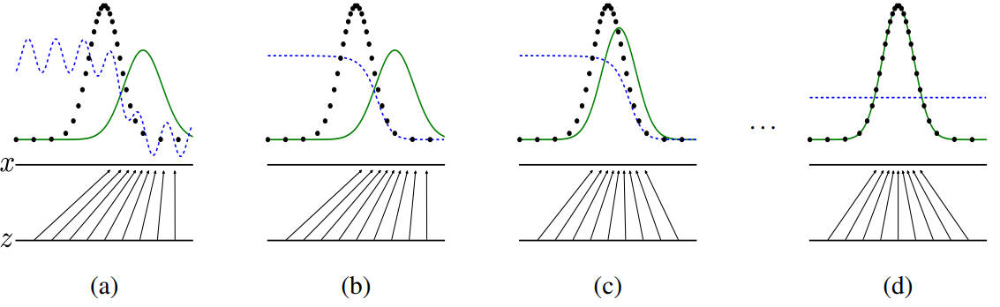
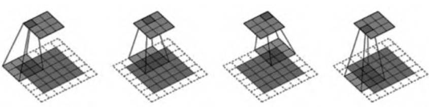
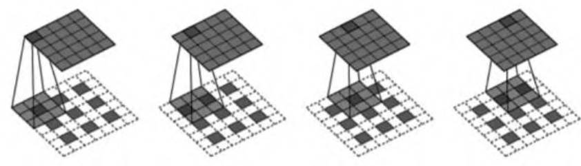
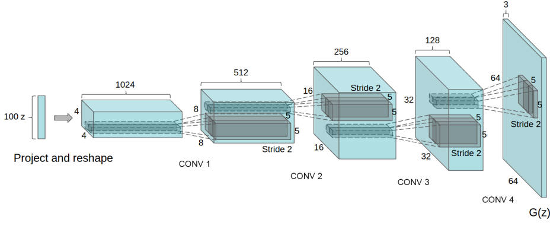
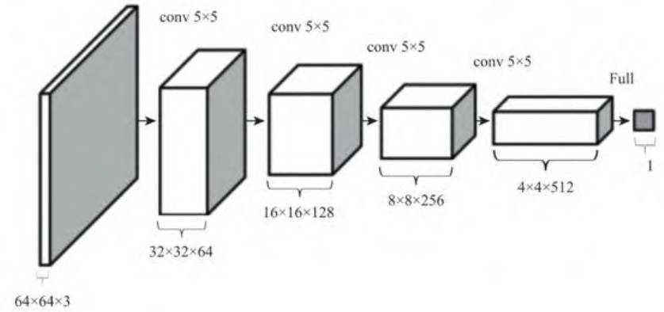
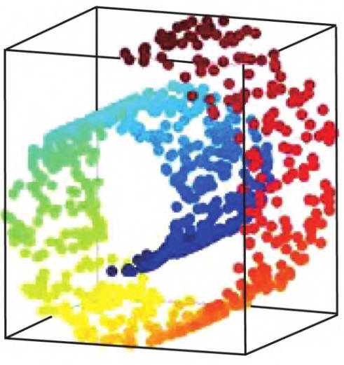

# GAN 神经网络-待修订版

## 1.GAN 生成式对抗网络

### 1.1 生成模型简介

生成模型是指能够再给定某些隐含参数的条件下，随机生成观测数据模型，它给观测值和标注数据序列指定了一个联合概率分布。

在机器学习中，生成模型可直接对数据建模，可根据某个变量的概率密度函数进行采样，也可以用来建立变量间的条件概率分布，条件概率分布可以由生成模型根据贝叶斯定理形成。

生成模型对于输入的随机样本能够产生我们所期望得生成数据，其特点在于学习训练数据，并根据训练数据的特点来产生特定分布的输出数据。

生成模型一般可以分为两个类型，生成对抗网络是第二种：

1. 生成的模型可以完全表示数据确切的分布函数
2. 生成的模型只能做到新数据的生成，而数据分布函数是模糊的

生成模型的功能就在于生成“假”数据，但具有各种作用：

- 生成模型具备表现和处理高维度概率分布的能力
- 生成模型尤其是生成对抗网络可以与强化学习领域相结合
- 生成模型可通过生成数据，从而能够优化完善半监督式学习
- 使用生成模型可用于超高解析度成像，将低分辨率的照片还原为高分辨率
- 也可以在不更换硬件的情况下提升其成像能力

### 1.2 自动编码器

生成模型就是让机器学习大量的训练数据，从而具备能够产生同类型新数据的能力。

自动编码器 (auto-encoder) 是一种**神经网络模型**，最初是为了对数据进行压缩。它的基本结构是一个多层感知器的神经网络，从输入到输出有多个隐藏层。

其结构的特点在于输入层和输出层拥有相同的节点数，中间编码层的节点数量小于输入层(输出层)的节点数。

该网络结构希望输出层的 $x'$ 能够很好地还原输入层的 $x$。而中间编码层为低维度，相当于进行了数据压缩。在自动编码器中，将输入层到编码层的网络部分(前半部分)称为**编码器**。后半部分即编码层到输出层称为**解码器**。

编码器将数据压缩，高维数据变为低维数据。解码器则将压缩数据还原，但是在降维还原过程中数据会有一定的损失。解码器和编码器绑定在一起训练，且训练的数据是无标签的。

对自动编码器进行某类型数据的训练后，编码器与解码器具备了此类型数据的解码/编码能力，此时可以单独使用解码器作为生成模型，编码层输入任意数据，解码器都可以产生对应的生成数据。

在生成模型中，一般仅使用后半部分。自动编码器看起来似乎是生成模型的一个不错的实现方案，但实际应用中存在许多问题，导致自动编码器不太适合用来做数据生成。现在的自动编码器网络结构仅仅能够记录数据，除了通过编码器以外我们无法产生任何**隐含编码 (latent code)** 用来生成数据。

当我们对解码器输入一个训练集中未出现过的编码时，可能输出的内容是噪声。而我们希望对于任意输入编码都能产生相关意义的数据。为了解决这个问题，研究人员提出了自动编码器的升级版本：**变分自动编码器(Variational Auto-Encoder,VAE)。** 

### 1.3 变分自动编码器

相对于普通的自动编码器，变分自动编码器 (VAE) 才是真正的生成模型。针对普通的自动编码器不能通过新编码生成数据的问题，VAE 在普通编码器上加了一些限制——要求**产生的隐含向量能够遵循高斯分布**。从而帮助自动编码器真正读懂训练数据的潜在规律，学习到输入数据的隐含变量模型。

如果说普通自动编码器通过训练数据学习到的是某个确定的函数的话，则 VAE 希望能够基于训练数据学习到**参数的概率分布**。

VAE 的具体实现方法为：

- 编码阶段将编码器输出的结果从一个变为两个，分别对应均值向量和标准差向量。
- 通过这两个向量我们形成了一个隐含变量模型，隐含编码向量正是通过对于这个概率模型的随机采样获得的。
- 最终通过解码器将采样获得的隐含编码向量还原为原始图片。

训练中需要考虑的问题：

1. 网络整体的准确程度
2. 隐含变量是否可以很好地吻合高斯分布

对应这两个问题形成了两个损失函数：

1. 描述网络还原程度的损失函数，输出数据与输入数据之间的均方距离。
2. 隐含变量与高斯分布相近程度的损失函数。

**KL 散度的引入**

(Kullback-Leibler divergence)，也称为相对熵。KL 散度的理论意义在于度量两个概率分布之间的差异程度。KL 散度越高，两者的差异程度越大。两者相同，KL 散度为 0。此处采**用 KL 散度计算隐含变量与高斯分布的接近程度。**

**损失函数的表示**

1. `generation_loss = mean(square(generated_imaged - real_image))`
2. `latent_loss = KL-Divergence(latent_variable,unit_gaussian)` 

`loss=generation_loss + latent_loss`，由 VAE 网络在训练过程中决定如何调节两个损失函数，达到最优的结果。

使用 VAE 后，生成数据变得很容易：

- 只需要从高斯分布中随机采样一个隐含编码向量。
- 将其输入解码器，即可生成全新的数据。

当然 VAE 也存在缺陷：在训练过程中最终模型的目的是为了使得输出数据与输入数据的均方误差最小化，使得 VAE 本质上并未学会如何生成数据，更**倾向于生成与真实数据更为接近的数据**。甚至在极端情况为了接近数据，模型会复制真实的数据。

而生成对抗网络 (GAN) 可解决上述缺点，让生成模型更加优秀。

## 2.从数学角度理解

### 2.1 最大似然估计(理解)

由费希尔 (R.A.Fisher) 引进的最大似然估计法，就是固定样本观察值 $x_1,x_2,\cdots,x_n$，在 $\theta$ 取值的可能范围内挑选使似然函数 $L(x_1,x_2,\cdots,x_n;\theta)$ 达到最大的参数值 $\hat{\theta}$ 作为参数 $\theta$ 的估计值。

首先对真实训练数据集定义一个概率分布函数：$Pdata(x)$，x 为实际数据集中的数据点。同时，也为生成模型定义一个概率分布函数 $Pmodel(x;\theta)$，通过参数 $\theta$ 的改变能够逼近真实数据概率分布。

实际计算中是无法确切知道 $Pdata(x)$ 的形式，只能采样大量的真实数据 $x_1,x_2,\cdots,x_m$ (即所谓的训练集) 来计算 $Pmodel(x(i);\theta)$。

根据训练集得出概率函数，即最大似然函数：
$$
L=\prod_{i=1}^{m}p_{model}(x^{(i)};\theta) 
$$
找到 $\theta$ 使得 $L$ 最大化，即在实际采样的数据上，让生成模型能够在这些数据上具备最大的概率。

**KL 散度公式**

假设两个概率分布：$P,Q$，在假定连续随机变量的前提下，对应的概率密度函数分别为 $p(x),q(x)$，对应的公式：
$$
KL(P||Q)=\int p(x)\log \frac{p(x)}{q(x)} dx
$$
当且仅当 $P=Q$ 时，$KL=0$，我们可以发现 KL 散度具备非负性，但不具备对称性。即 $P$ 对 $Q$ 的散度不等于 $Q$ 对 $P$ 的 KL 散度。

我们希望最小化真实数据分布与生成模型分布之间的 KL 散度，从而使得生成模型尽可能接近真实的数据分布，即使用训练数据形成的经验分布逼近 $Pdata(x)$。

需要说明的是，在实际的使用过程中，最大似然估计方法生成的模型通常比较模糊，因为一般的简单模型无法使得 $Pmodel(x;\theta)$ 真正逼近真实的数据分布。真实的数据是非常复杂的，为了模拟复杂分布，可采取神经网络 (如 GAN) 实现，实现将简单分布映射成为任何的复杂分布。

lan 在 NIPS2016 的文章中给出了基于似然 估计的生成模型分类。

说明了基于似然估计的生成模型可分为两个主要分支：①显式模型；②隐式模型；两者的核心在于生成模型是否需要计算出明确的概率分布密度函数。一般情况，研究生成模型的目的往往在于生成数据，对确切的分布密度函数并不关注，而 GAN 就属于后者。

### 2.2 GAN 数学推导

生成模型的作用就是将数据从输入空间映射到生成空间，用公式表示为：$x=G(z)$。通常输入会满足简单形式的随机分布，而为了保证生成空间的数据分布尽可能逼近真实的数据分布，生成函数 $G$ 会是一个神经网络的形式。而通过神经网络可以模拟出各种不同的分布类型。

生成对抗网络中的代价函数：判别器 $D$ 的代价函数为 $J^{(D)}$，而对于生成器的代价函数 $J^{(G)}$ 来说，两者的关系可以看作一个零和博弈，代价综合应该为 0，即满足 $J^{(G)}=-J^{(D)}$。

这样以来，就可以设置一个价值函数 V 来表示 $J^{(G)},J^{(D)}$：
$$
V(\theta^{(D)},\theta^{(G)})=E_{x\sim P_{data}}\log D(x)+E_{x\sim P_{z}}\log(1-D(G(z)))\\
J^{(D)}=-\frac{1}{2}V(\theta^{(D)},\theta^{(G)}) \\
J^{(G)}=\frac{1}{2}V(\theta^{(D)},\theta^{(G)})
$$
将问题转变为寻找合适的 $V$ 使得 $J^{(G)},J^{(D)}$ 尽可能小，即对于判别器 $J^{(D)}$ 来说 $V$ 越大越好，而对于生成器$J^{(G)}$ 来说 $V$ 越小越好。简单来说就是寻找极大极小值的问题，用图形化的方式理解就是鞍点 (saddle point)。

假定生成器 $G$ 是固定的：
$$
V(\theta^{(D)},\theta^{(G)})=E_{x\sim P_{data}}\log D(x)+E_{x\sim P_{z}}\log(1-D(G(z)))\\
=E_{x\sim P_{data}}\log D(x)+E_{x\sim P_{g}}\log(1-D(x))
$$
最终求得理想判别器 $D^*(x)$ 为：
$$
D^*(x)=\frac{p_{data}(x)}{p_{data}(x)+p_{g}(x)}
$$
由上式可以看出其范围在 $0 \sim 1$ 之间，理想的判别器接收到真实数据时应判断为 1，对于生成数据则应该为 0。

**JS (Jensen Shannon) 散度** 和前面的 KL 散度一样，具备**测量两个概率分布相似程度的能力**，其计算基于 KL 散度，继承了 KL 散度的非负性，同时具备 KL 散度不具备的对称性，设 $\displaystyle M=\frac{1}{2}(P+Q)$。
$$
JSD(P||Q)=\frac{1}{2}KL(P||M)+\frac{1}{2}KL(Q||M)
= \frac{1}{2}KL(P||\frac{P+Q}{2}+\frac{1}{2}KL(Q||\frac{P+Q}{2})\\
KL(P||Q)=\int p(x) \log \frac{p(x)}{q(x)}dx
$$

找到 $D^{*}(x)$ 后，推导出最优生成器 $G^{*}$，此时 $p_{g}=p_{data}$。

### 2.3 可视化理解

lan Goodfellow 在文章《Generative Adversarial Nets》中给出了一个 GAN 可视化的例子，其中的点线为真实数据分布，实心曲线为数据样本。GAN 的目的就是让曲线 (生成数据的分布) 逐渐逼近点线 (真实数据分布)。

虚线为 GAN 中的判别器，用于初步区分真实数据与生成数据的能力。输入域为 $z$，默认为均匀分布的数据，生成域为 $x$，是不均匀分布数据。通过生成函数 $x=G(z)$ 形成映射关系。

- 图 a 是一种初始状态，生成数据与真实数据有较大的差距，判别器具备初步的划分能力，但由于存在噪声，效果仍有缺陷。
- 图 b，使用两类标签数据对于判别器进行训练，判别器 $D$ 逐渐向一个比较完善的方向收敛，当判别器逐渐完美后，开始迭代生成器 $G$。
- 图 c，以判别器 $D$ 的导数梯度方向为指导，让生成数据向真实数据的分布方向移动。让生成数据更容易被判别器判断为真实数据。
- 图 d，最终状态，此时 $p_g$ 非常逼近 $p_{data}$，理想状态中 $p_g=p_{data}$ 时，生成器 $G$ 生成的数据已经满足要求，即完全可以模拟出真实数据分布，而判别器 $D$ 在该状态下无法分辨两种数据的分布 (因为此时两种数据已经完全一样)，故有：$\displaystyle D(x)=\frac{1}{2}$。

### 2.4 GAN 实现

优化公式为：
$$
V(\theta^{(D)},\theta^{(G)})=E_{x\sim P_{data}}\log D(x)+E_{x\sim P_{z}}\log(1-D(G(z)))\\
$$
实践中使用采样的方法逼近期望值，首先从随机分布 $p_{g}(z)$ 中取出 $m$ 个随机数 $\{z(1),z(2),\cdots,z(m) \}$，接着从真实数据分布 $p_{data}(x)$ 中取出 $m$ 个真实样本 $\{x(1),x(2),\cdots,x(m) \}$，并使用平均数代替上式中的期望：
$$
V=\frac{1}{m}\sum_{i=1}^{m} [\log D(x)+\log(1-D(G(z)))]\\
$$
**简单 GAN 实现**

用 TF 框架实现最基础的版本。

## 3.深度卷积生成 GAN

在实际应用中很少直接使用最基础的版本，一般使用的是**深度卷积生成对抗网路 (DCGAN)**。

DCGAN 的创始论文 《Unsupervised Representation Learning with **Deep Convolutional Generative Adversarial Networks**》，在 GAN 的基础上提出了全新的 DCGAN 架构。该网络在训练过程中状态稳定，并可以有效实现高质量的图片生成及相关的生成模型应用。

为使得 GAN 很好地适应卷积神经网络架构，DCGAN 提出四点架构设计规则：

- 使用卷积层代替池化层
- 去除全连接层
- 使用批归一化 (batch normalization)
- 使用恰当的激活函数

1. **将传统 CNN 中的池化层全部去除，使用卷积层代替**。对于判别器，使用步长卷积 (strided convolution) 代替池化层；对于生成器，使用分数步长卷积 (fractional-strided convolutions) 来代替池化层。

   如下为步长卷积示例，卷积层在判别器中进行空间**下采样** (spatial downsampling)，输入 5×5 矩阵，使用 3×3 过滤器，步长 2，输出 3×3。

   

   下图表示的是卷积层在生成器**上采样** (spatial upsampling)，输入为 3×3 矩阵，过滤器为 3×3 ，步长 2×2，输出为 5×5。

   

   **使用卷积层代替池化层的目的是能够让网络自身去学习空间上采样与下采样，使得判别器和生成器能够具备相应的能力。**

2. **去除全连接层**。全连接层参数过多，随着神经网络深度的增加，运算速度会变得非常慢。同时全连接也容易导致网络过拟合，一种折中方案是将生成器的随机输入直接与卷积层特征输入进行连接。

3. **使用批归一化 (batch normalization，BN)**，神经网络的层数多，每层都会使得输出数据偏差越来越大。通过对每个输入层的输入进行归一化处理，可以使得数据服从某个固定的分布。

4. **生成器使用了 ReLU 函数**，输出层使用了 Tanh 激活函数。一般来说，有边界的激活函数可以让模型更快地进行学习，能快速覆盖色彩空间。**判别器使用 LeakyReLU 函数**，尤其适用于高分辨率的图像判别模型。

### 3.1 DCGAN 结构

如图，DCGAN 生成器 G 的架构图，输入数据为 100 维的随机数据 z，服从范围在 [-1, 1] 的均匀分布，经过一系列分数步长卷积后，得到 64×64×3 的图片，与训练图片大小一致。

判别器 D 的架构图基本是生成器 G 的反向操作，输入层为 64×64×3 的图像数据，经过一些列卷积层降低数据的维度，最终输出为一个二分类数据。

对于训练中的一些细节设计：

- 用于训练的图像数据样本，仅将数据缩放到 [-1,1] 范围内，不做任何其他处理。
- 模型采用 Mini-Batch 大小为 128 的批量随机梯度下降方法进行训练。权重的初始化使用满足均值为 0，方差为 0.02 的高斯分布的随机变量。
- 对于激活函数 LeakyReLU，Leak 部分的斜率设置为 0.2
- 训练过程中使用 Adam 优化器进行超参数调优，学习率使用 **0.0002**，动量 $\beta_1=0.5$，使得训练更加稳定。

### 3.2 TF 创建 DCGAN 网络

具体内容见：[DCGAN的TF实现.ipynb](code/DCGAN的TF实现.ipynb)

### 3.3 DCGAN的实验性应用

**生成图像的变换**

1. 图像的隐含空间 (Latent Space)：随着输入 Z 的不断变换，输出的图像会平滑地转变为另一幅景象。
2. 无监督式 DCGAN 在基于大量图片数据进行训练后同样能够学习到很多特征。
3. 移除生成器相关特征的 `filter` 后可以发现，被修改的生成器在不影响整体情况的前提下，将该特征从画面中抹去了。

**生成图像的算术运算**

词嵌入：将单词映射到一个低维度连续向量空间中的技术，用词嵌入技术构成的词向量在空间中具备了一定的语义关系，含义比较接近的词在词向量空间中的距离会比较接近。

`Vector("King")-Vector("Man")+Vector("Woman")=Vector("Queen")`

此外，TF 网站中有一个 [Embedding Projector](http://projector.tensorflow.org/) 项目，可实际感受词向量的可视化展示。

类似于词向量的计算思路，在不使用 GAN 技术的情况下，直接使用像素作为向量计算的结果并不好，基本无法分辨出效果。

而在 GAN 的**生成器**中其实已经有了**输入向量**和**输出图像**的对应关系，因此可以把该向量作为图像的向量表示。例如：带笑脸的女人 - 普通表情的女人 + 普通表情的男人 = 带笑脸的男人。

基于上述方法，我们可以进行图像演变的制作，当我们把某个图像的向量线性转换为另一个图像的向量是。对应的图像会逐渐转移，而且整个转移过程非常流畅。

**残缺图像的补全**

要使用 GAN 补全图像需要满足两个条件：

- 使用 DCGAN 再经过大量头像数据训练后能够生成骗过判别器的照片
- 生成图像与原图像未丢失部分的差值要尽量最小

两个损失函数：

- 与丢失信息图片相关的上下文损失 (contextual loss)，即生成图片与原始图片在未丢失区域的差距大小。
  $$
  L_{contextual}(z)=||M \odot  G(z) - M \odot  Y||\\
  $$
  其中 $M$ 为遮罩，即只选择未丢失区域计算损失函数。
  
- DCGAN 本身的感知损失 (perceptual loss)，这是对于 DCGAN 本身在大量人脸数据集上训练的损失函数，与之前 GAN 中生成器的损失函数一致。
  $$
  L_{perceptual}= \log(1-D(G(z)))
  $$

最终完整的损失函数与计算结果分别为：
$$
L(z)=L_{contexttual}(z) + \lambda L_{perceptual}(z)\\
\hat{z} = \arg \min_{\lambda} L(z)
$$
其中：$\lambda$ 为超级参数，用来调节两个损失函数的重要程度，$\hat{z}$ 是要求的生成器输入。最终的图片补全公式为：
$$
x_{reconstructed} = M \odot Y + (1 - M) \odot G(\hat{z})
$$
相比于其他方案，DCGAN 的补全方法更好。

## 4. Wasserstein GAN

### 4.1 GAN 训练的不稳定性

在训练 GAN 的过程中会出现很多问题，其中最大的问题来源于训练的不稳定性。**实际操作中会发现，当判别器训练得越好，生成器反而越难优化。**

一些理论知识：从理论和经验来说，**真实数据的分布**通常是一个**低维度流形** (manifold)。即数据虽然分布在高维空间中，但是实际数据并不具备高维度特性，而是存在于一个嵌入在高维度的低维度空间里。

之前的生成器做的事情就是把一个**低维度的空间** $Z$ **映射**到与真实数据相同的**高维度空间**上。我们希望的是把这个低维度流形尽可能地逼近真实数据的流形。

理论上来说，如果真实数据与生成数据在空间上**完全不相交**，则可以得到一个判别器来完美划分真实数据与生成数据。此外，如果真实数据和生成数据在低维度上没有一部分能够完美地全维度重合，即它们的交集在高维度上测度为 0，存在一个判别器能够完美地划分数据。

在实践中，上面地情况非常常见，即生成数据与真实数据在空间中完美重合的概率非常低。大部分情况都可以找到一个判别器将生成数据与真实数据加以划分。**而这就会导致在网络训练的反向传播中，梯度更新几乎为 0，即网络很难在这个过程中学到任何东西。**

真实数据 $P_r$ 和生成数据 $P_g$ 无法全维度重合情况下的 $KL$ 散度和 $JS$ 散度表示：
$$
JSD(P_r||P_g) = \frac{1}{2}KL(P_r||\frac{P_r+P_g}{2})+\frac{1}{2}KL(P_g||\frac{P_r+P_g}{2})=\log 2\\
KL(P_r||P_g) = \int P_r \log \frac{P_r}{P_g}dx=+ \infty\\
KL(P_g||P_r) = + \infty
$$

